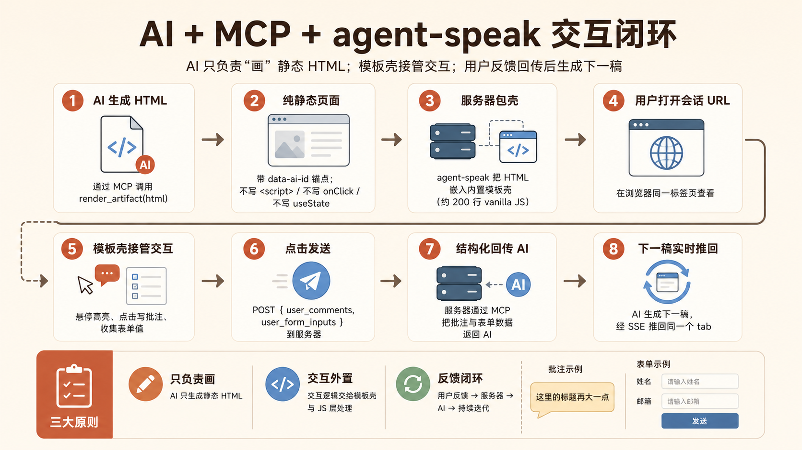

# agent-speak

让 AI 用富 UI 而非 markdown 跟你对话——AI 输出一段静态 HTML,你在浏览器里批注、填表、提交,结构化反馈再回到 AI。

## 这是什么

`agent-speak` 是一个 MCP server,把 AI 的输出从"长 markdown"变成"可交互页面"。它对外暴露三件事:

- **设置会话(`set_session`)**——会话第一步。选一套内置模版(报纸 / 极简白 / 暗夜霓虹 / 柔和糖果 / 杂志大刊)或注册自定义 CSS,拿到要交给用户打开的 URL(打开后预热连接),并把模版的完整 CSS 源码、`render_artifact` 的 HTML 写法契约、以及这套模版的排版引导一并回传给 AI。
- **推一份 UI(`render_artifact`)**——AI 提交一段用 `ass-*` 语义类、带稳定锚点的静态 HTML,服务端推到用户已打开的 tab,然后**同步阻塞**等用户提交,一次工具调用就把反馈带回来(省掉一次大模型往返)。页面还没连上时**立即返回 URL、不空等**。
- **取回反馈(`wait_user_feedback`)**——render 超时还没等到时的续等手段:再阻塞一段时间继续等用户提交。

所有模版**共用同一组 `ass-*` 语义类**,所以换模版时 AI 的 HTML 一个字都不用改——切的只是皮肤。

核心约定:**AI 永远不写交互代码**(没有事件绑定、没有状态、没有脚本)。所有交互——悬停高亮、批注、表单收集、提交——全部由浏览器这一侧的壳子负责。AI 写错了也只会"画得难看",绝不会卡住提交链路。

无 Redis、无数据库、无 Node、无 React。一个 Python 进程 + 一份原生 JS 浏览器壳子(约 550 行,无构建步骤)。



## 用户能做什么

页面右下角永远有一个"日记本 + 工具栏"。工具栏从左到右是:

- **批注**(默认开启,可开关)——开启时,鼠标悬停在任何 AI 锚定的元素上会出蓝色高亮,**直接点击**即可在日记本里写一条批注。已批注的元素会在右上角内角嵌一个红色数字徽章,点徽章回去编辑或删除。
- **🎨 图片**(仅在页面含 `` 时出现)——打开图片画布弹窗,管理所有图片的生成、上传、选择。
- **预览并发送**(绿色)——预览要回传的内容(批注 + 表单 + 图片),确认后发送给 AI。
- **?**——使用教程(首次也会自动弹一次)。

提交完页面**不会关闭**,顶上会盖一层"请保持页面打开"的提示,等下一稿推过来时自动消失。

## 渲染流程

固定顺序,没有"一次同步一次异步"的分支——心智模型统一:

### 1) `set_session`——选皮肤 + 给 URL + 发契约和引导

会话开场调一次:选模版(默认 `报纸`)或传一段自定义 `css`。返回里有:

- `url`:**交给用户,让他现在就打开**。页面先显示"等待内容中",这一步把 SSE 连接预热好——之后每次 render 都能直接同步拿反馈。
- `preset_css`:所选模版的完整 CSS 源码(`@apply` 的实际内容),方便 AI 写自定义类时跟模版对齐。
- `render_html_contract`:`render_artifact` 的 `html` 参数怎么写(语义类清单、`data-ai-id` 锚点、提交规则)。这段契约**只在这里返回一次**,不塞进 render 的常驻 tool description,省 token。
- `template_guide`:这套模版适合什么内容、版面节奏怎么排(长材料的层级 / 重心 / 留白思路)——照着编排,而不只是套对类名。
- `available_templates`:可选模版清单。

可**反复调用**:中途加新类、换模版、`reset` 清空都行;用户页面已开的话,样式**热更新**,不重渲染(改的是已有类的样式或换模版时立即生效;新增一个类要让元素用上它,得 render 一份引用了该类的新 HTML)。

### 2) `render_artifact`——推 UI + 同步等反馈

把 HTML 推到已打开的页面,然后**同步阻塞**最多 `max_wait_seconds`(默认 180、上限 180)等用户提交:

- **提交了**:返回 `{feedback}`。一次工具调用同时完成"推 + 收",不必再调别的工具。
- **超时 / 页面没连上**:返回 `{status:"pending", connected}`。`connected:true` = 页面在线、只是用户慢了一拍(**别重推**);`connected:false` = 用户还没打开 URL——**此时立即返回、不空等**,把 `url` 交给用户打开即可(artifact 已缓存,一打开就看到)。两种都用下面的 `wait_user_feedback` 接力。

> 注意:同步阻塞可能超过某些 MCP 客户端的默认工具超时。客户端提前中止时服务端状态仍在——再调一次 `wait_user_feedback` 接回来即可。

### 3) `wait_user_feedback`——续等

render 返回 `{pending}` 后接力等用户提交:阻塞最多 `max_wait_seconds`(默认 60、钳制在 1–180 秒)。提交则返回 `{feedback}`;**超时抛错**——这不是故障,artifact 还在页面上,想继续等再调一次即可(**别重推**)。

## 启动

仓库根目录,装好 `uv`:

```bash
uv sync                                # 一次性,建好 .venv
uv run agent-speak                     # stdio 模式,127.0.0.1:11002,自动开浏览器
uv run agent-speak --port 11003        # 换端口
uv run agent-speak --no-open           # 别自动开浏览器
uv run agent-speak --http \            # streamable-http 模式
        --public-url https://ask.example.com \
        --host 0.0.0.0 --port 8000
```

发布到 PyPI 之后可以直接 `uvx agent-speak` / `uv tool install agent-speak`。

## 接入 MCP 客户端

### 直接用公网托管版(最快)

不想自己跑,直接接已经部署好的实例。

**Claude Code 一行装好:**

```bash
claude mcp add --transport http agent-ask https://agent-ask.liuhetian.work/mcp
```

(默认只在当前项目生效;想全局可用加 `--scope user`。)

其它客户端(Claude Desktop 等)用 JSON 配置:

```json
{
  "mcpServers": {
    "agent-ask": {
      "url": "https://agent-ask.liuhetian.work/mcp",
      "transport": "streamable-http"
    }
  }
}
```

无需安装、无需端口、无需反代。

> 公网实例无鉴权,会话 URL 是 UUID 强度的——别在公开场合贴出来。介意隐私就跑本地 stdio。

### 本地 stdio

仓库内开发期:

```json
{
  "mcpServers": {
    "agent-speak": {
      "command": "uv",
      "args": ["run", "--directory", "/abs/path/to/agent-speak", "agent-speak"]
    }
  }
}
```

## 写一份 UI

先 `set_session` 选好皮肤(它会把 `html` 写法契约和这套模版的排版引导一起返回),再把一段纯 HTML 交给 `render_artifact`——优先用 `ass-*` 语义类(跟所选模版风格统一,无需自己堆样式):

```html
<div class="ass-panel">
  <h1 data-ai-id="title" class="ass-h1">新项目配置</h1>
  <div class="ass-field">
    <label for="n" class="ass-label">项目名</label>
    <input id="n" data-ai-id="project-name" type="text" class="ass-input" />
  </div>
  <label class="ass-check-row">
    <input data-ai-id="want-auth" type="checkbox" /> 需要登录
  </label>
</div>
```

预设类清单:布局 `ass-panel`/`ass-section`/`ass-row`/`ass-col`;文字 `ass-h1`/`ass-h2`/`ass-hint`/`ass-code`/`ass-kbd`/`ass-divider`;表单 `ass-field`/`ass-label`/`ass-input`/`ass-textarea`/`ass-select`/`ass-check-row`;按钮 `ass-btn` + `ass-btn-primary`/`ass-btn-ghost`/`ass-btn-danger`;提示 `ass-alert` + `ass-alert-info`/`ass-alert-warn`/`ass-alert-danger`。需要新类就去 `set_session(css=...)` 注册,别在 HTML 里写 `<style>`。

用户提交后,反馈大概长这样:

```json
{
  "feedback": {
    "user_comments": [
      { "target_id": "title", "element_html_hint": "<h1 ...>新项目配置</h1>",
        "instruction": "改成更轻松的语气" }
    ],
    "user_form_inputs": [
      { "ai_id": "project-name", "label": "项目名", "name": null,
        "type": "text", "value": "agent-speak" },
      { "ai_id": "want-auth", "label": "需要登录", "name": null,
        "type": "checkbox", "value": true }
    ]
  }
}
```

### HTML 的几条契约

- **纯 HTML**(通过 innerHTML 注入),不能写 React / JSX / 任何状态。
- **样式优先用 `ass-*` 预设类**(模版已注入),其次 Tailwind 工具类(CDN 已预加载)。要自定义类去 `set_session(css=...)` 注册。`<style>` 块和外链样式表会在注入时被剥掉(否则会污染整页、冲掉前端壳子),不要在 HTML 里写。行内样式属性保留作为应急通道,但请优先用预设类。
- **不能有任何交互代码**:`<script>`、`<iframe>`、`<object>`、`<embed>`、`<link>`、`<meta>`、`<base>`、`<html>`、`<head>`、`<body>` 这些标签注入时会被剥;所有事件属性(`onclick`、`onchange` ……)也会被剥。所有交互都由前端壳子接管。
- 每个有意义的元素都加一个稳定、描述清晰的 `data-ai-id="kebab-case-id"` 锚点,前端壳子通过它寻址、批注、回传。
- 每个表单输入都配一个 `<label>`(包裹式或用 `for=` 都行),前端壳子会自动把人类可读的标签和值绑在一起。
- 每次推送都会**替换**上一份 UI,清空已有批注和表单值。同一会话内复用同一个 tab。
- 用户提交后页面**故意不关**,只在顶部盖一层"请保持此页面打开"的提示,以便下一稿直接复用同一个 tab。

## 局限

- 无持久化。重启后正在等的会话全丢。
- 一份会话只能对应一个活跃的浏览器 tab——后开的接管,先开的会被告知"已在别处打开"。
- 无鉴权。URL 里的会话标识是 UUID 强度的,猜不出来,但**任何拿到 URL 的人都能提交**。不要在公开场合贴出来。
- AI 不能写 JS 交互。拖拽、tab 切换、多步向导这类**必须**拆成多轮 UI 交换(每次推送都会替换前一份)。
- 浏览器要求支持事件源(EventSource)与 `CSS.escape`(2023 年以后的现代浏览器都行)。

## Changelog

### v0.4.1 (2026-06-23)

**配图风格建议 & 模版预设拆分**

- `set_session` 新增 `image_style_guide` 返回字段——每套模版配一段建议的图片生成风格(版画 / 扁平矢量 / 赛博霓虹 / 绘本水彩 / 杂志摄影)+ 参考 prompt 关键词,让 AI 写 `` prompt 时图文气质统一。建议而非强制,每张图可按内容灵活调整。
- `render_html_contract` 的 `` 规范新增"何时用"选型指南:4 类适合场景(概念隐喻图、角色场景插画、体验故事板、系统全景图)+ 不适合场景(需精确数值/对齐的图用 Mermaid/HTML/SVG)。
- 重构:从 `template.py`(3100+ 行)拆出 `presets.py`(571 行),所有模版预设数据(CSS 皮肤、壳子主题、排版引导、配图风格、Mermaid 主题映射)集中在 `presets.py`,`template.py` 只保留渲染引擎。新增模版只需改 `presets.py`,渲染引擎无需变动。

### v0.4 (2026-06-23)

**代码高亮 & 图表渲染**

- 集成 highlight.js——`<pre><code class="language-xxx">` 自动语法高亮,五套模板各自搭配独立配色方案。
- 集成 Mermaid.js(按需加载)——`<pre class="mermaid">` 自动渲染为 SVG,支持 flowchart / sequence / gantt / classDiagram 等,每套模板匹配对应 Mermaid 主题。

**导出独立 HTML**

- 新增 `GET /ui/{sid}/export`——后端复用渲染逻辑,生成无 host 壳子的自包含 HTML 文件下载。
- 导出时 `` 自动转为 base64 data URI 内联,断网可看。
- 导出 HTML 携带 Tailwind CDN + highlight.js CDN + Mermaid 按需加载,打开即与在线版一致。

**浏览器端模板切换**

- "?"对话框新增第 4 个 tab"设置",含模板下拉切换 + 导出按钮。
- 新增 `POST /ui/{sid}/switch-template`,切换后 SSE 热刷新,无需 AI 介入。
- `render_artifact` / `wait_user_feedback` 返回值新增 `template` 字段,AI 能感知用户切了模板。

**img-ai 增强**

- 新增 `size` 属性(1024x1024 / 1536x1024 / 1024x1536 / auto),控制生图尺寸。
- 新增 `width` / `height` 属性,控制图片显示大小(去掉了之前写死的 512px 上限)。
- `prompt` 属性约束语言与报告正文一致(中文报告写中文 prompt)。

**契约更新**

- `render_html_contract` 补充代码块(`<pre><code>`)和 Mermaid(`<pre class="mermaid">`)写法约定。
- `render_html_contract` 补充 `` 的 `size` / `width` / `height` 属性说明。

### v0.3 (2026-06-15)

**新功能:图片画布(`` 元素)**

- 新增 `` 自定义元素——AI 只写声明式标签,host 接管图片的生成、显示、选择和编辑。
- 三种用法:带 `prompt` 自动生成、带 `image-id` 直接显示预上传图片、纯 `placeholder` 占位等用户操作。
- 图片画布弹窗:支持输入提示词生成、粘贴/拖放上传、左键选定、右键设参考图、指派到任意槽位。
- 后端新增 `/api/{sid}/generate`、`/api/{sid}/upload`、`/api/{sid}/assign-image`、`/api/{sid}/image-pool`、`/assets/{sid}/{image_id}.png` 路由,支持 OpenAI 兼容的图片生成 API。
- 提交反馈 payload 新增 `image_results` 字段。

**UI 改进**

- "预览"和"发送"合并为"预览并发送",统一走预览弹窗确认流程。
- 批注/图片/预览三面板互斥,不再重叠。
- 修复弹窗在拖选文字时意外关闭的问题。

### v0.2 (2026-06-09)

**多模板系统 & 壳子主题**

- 五套内置模板:报纸(默认)、极简白、暗夜霓虹、柔和糖果、杂志大刊。
- 统一 `ass-*` 语义类——换模板时 AI 的 HTML 一个字都不用改。
- 壳子主题(host chrome themes):右下角工具栏/日记本/弹窗跟内容区同步换肤。
- `set_session` 返回模板排版引导 + CSS 纪律,让 AI 知道"怎么排才好看"。
- 自定义 CSS 注册(`set_session(css=...)`)+ 热更新(不重渲染 artifact)。

### v0.1 (2026-05-18)

**初版:核心交互闭环**

- 三件套 MCP 工具:`set_session` / `render_artifact` / `wait_user_feedback`。
- AI 写纯静态 HTML → 推到浏览器 → 用户批注 + 填表 → 结构化反馈回传。
- 浏览器壳子:自动锚点、悬停高亮、批注日记本、表单收集、SSE 实时推送。
- 同步阻塞等反馈设计——一次 `render_artifact` 调用完成"推 + 收"。

## 感谢

[linux.do](https://linux.do)
